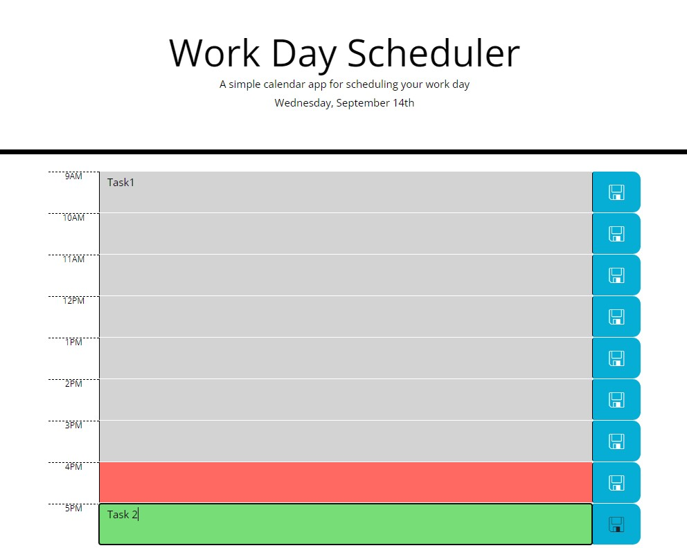

# Work Day Scheduler

## Description

In order to build a successful scheduling application for an employee with an average work day, this application needs to give the user the current date and time, allow user to input tasks for each hour, and save those tasks even after page refresh. While HTML and CSS starter code were provided, they lacked time slots or the correct usage of Bootstrap to format the page aesthetically. After including enough time slots for the average work day, I used Bootstrap classes in order to better present the layout of the webpage. I also included classes for the JavaScript to select from in order to function alongside Moment.js API to give the user accurate date and time information. Moving on to the JavaScript code, I began by setting variables for the date, the hour, and each hour class. By parsing the integer of each hour class I was able to compare that to the current hour using Moment.js and color code the time blocks to grey (past), red (present), or green (future). Lastly, I set the hour time blocks and user input tasks as key: value pairs to local storage on the save button click and made sure they persisted even after page refresh. This application served as great practice for using a CSS framework like Bootstrap and APIs such as Jquery and Moment.js. 

#
## Usage

To view the website application please follow the provided link: 
https://emmasiren.github.io/work-day-scheduler/

The following image shows the web application when loaded correctly.

